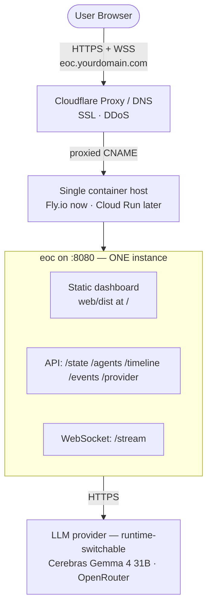

# EOC Deployment Guide: Single-Origin on Fly.io + Cloudflare

This guide deploys the **Cerebro Emergency Operations Center (EOC)** as a
**single origin**: one Go container serves *both* the static Astro/Svelte
dashboard *and* the API/WebSocket, fronted by **Cloudflare** for DNS, SSL, and
DDoS protection.

> **Chosen target (2026-06-29): Fly.io now, Cloud Run later.** Fly is the fastest
> path to a single always-on container and is on a 7-day trial. Because we deploy
> the **same OCI image** ([`Dockerfile`](Dockerfile)) either way, switching to
> **Google Cloud Run** later is cheap: same image, move the two secrets, repoint
> the Cloudflare CNAME. The Cloud Run recipe is preserved in **§7** for that
> migration.

> **Why single-origin (not Pages + separate API)?** The frontend talks to the
> backend **same-origin**: the WebSocket URL is `wss://<page-host>/stream`
> ([`web/src/components/Dashboard.svelte`](web/src/components/Dashboard.svelte))
> and REST calls are relative (`fetch("/state")`). Splitting the UI and API onto
> two subdomains would make every live call cross-origin → the dashboard would
> silently fall back to its offline **demo mode**, and would additionally require
> CORS middleware (the API has none). Serving both from one container matches the
> code as written, removes CORS entirely, and removes a whole deploy target.

---

## 0. The single-instance rule (applies to EVERY platform)

**This service must run as exactly one instance.** World state lives in memory
([`internal/state`](internal/state)) and is pushed to WebSocket clients; the
scenario replay runs per-process. Two instances would mean two divergent world
states, two replays, and browsers seeing different COPs depending on which
instance they hit.

So on **any** host we pin to **one** instance and let one box serve everyone
(high per-instance concurrency is fine for a demo crowd):
- **Fly.io:** `fly scale count 1`, `auto_stop_machines = false`,
  `min_machines_running = 1`.
- **Cloud Run (§7):** `--min-instances 1 --max-instances 1`.

This design has **no HA/failover** on purpose — single instance is the constraint,
not the platform. Resilience comes from auto-restart-on-crash, not redundancy.

---

## 1. Deployment Architecture



One container, one origin:
1. **Static dashboard** — the built `web/dist` is served at `/` by the Go server.
2. **API + WebSocket** — `/state`, `/agents`, `/timeline`, `/events`, `/provider`,
   `/stream` on the same host. No CORS needed (same origin).
3. **Cloudflare** — one proxied CNAME → the container host, free SSL/TLS, DDoS.

---

## 2. Prerequisites

- The Go server (a) serves the static build and (b) **listens on `$PORT`**
  (fallback `8080`), serving the directory in `WEB_DIR` (default `web/dist`) at
  `/`. See HANDOFF §8 parcel **P6**. Fly maps its public `:443` → the container's
  `internal_port`; Cloud Run injects `$PORT`. The same binary satisfies both.
- A single image carries the Go binary **and** `web/dist` (multi-stage
  [`Dockerfile`](Dockerfile); parcel **P8**).
- Local dev/test: copy `.env.example` → `.env` for `PORT`, `WEB_DIR`,
  `CEREBRAS_*`, `OPENROUTER_*` (see §4.1).
- `flyctl` installed and authenticated (`fly auth login`).

---

## 3. Build & smoke-test the image locally (do this first)

The multi-stage [`Dockerfile`](Dockerfile) builds the web assets and the Go binary
into one distroless runtime image. Validate it locally before any cloud push —
this is the build authority (SPEC §19.3):

```bash
docker build -t opsec-control:dev .          # or: task docker:build
docker run --rm -p 9090:9090 \
  -e PORT=9090 \
  -e CEREBRAS_API_KEY=... -e OPENROUTER_API_KEY=... \
  opsec-control:dev
```

Confirm `http://localhost:9090/` loads in **live** mode, the scenario replays,
and the `/provider` switch works. (Fly builds the same Dockerfile remotely, so a
clean local build ≈ a clean Fly build.)

> **Keep secrets out of build layers:** `.dockerignore` must exclude `.env*` so a
> local `.env` is never copied into the `COPY . .` build stage.

---

## 4. Deploy to Fly.io

### 4.1 `fly.toml`

Commit this at the repo root (or let `fly launch --no-deploy` scaffold it, then
reconcile against the settings below — the hardening here is what makes a
single-instance WebSocket demo reliable):

```toml
app = "cerebro-eoc"          # your Fly app name (must be globally unique)
primary_region = "iad"       # US-East, near Cerebras/OpenRouter — low fan-out latency

[build]
  dockerfile = "Dockerfile"

[env]
  PORT = "8080"
  WEB_DIR = "/web/dist"
  CEREBRAS_MODEL = "gemma-4-31b"
  OPENROUTER_MODEL = "google/gemma-4-31b-it"

[http_service]
  internal_port = 8080
  force_https = true
  auto_stop_machines = false   # never idle the box — would drop live WebSockets
  auto_start_machines = true
  min_machines_running = 1      # always one instance warm

  [http_service.concurrency]
    type = "requests"
    soft_limit = 200
    hard_limit = 250            # long-lived WS connections count here — keep generous

  [[http_service.checks]]
    method = "GET"
    path = "/state"            # 200 once the server is up
    interval = "15s"
    timeout = "2s"
    grace_period = "10s"

[[restart]]
  policy = "always"            # single-instance resilience = self-heal on crash

[[vm]]
  size = "shared-cpu-1x"
  memory = "512mb"             # Go + many WS clients; 256mb is tight
```

### 4.2 Launch, set secrets, pin to one machine, deploy

```bash
fly launch --no-deploy                       # creates the app from fly.toml (don't deploy yet)

# Secrets (NOT in fly.toml — these are encrypted in Fly):
fly secrets set CEREBRAS_API_KEY=sk-... OPENROUTER_API_KEY=sk-or-v1-...

fly deploy                                   # builds the Dockerfile remotely, releases
fly scale count 1                            # enforce the single-instance rule (§0)

fly status                                   # confirm exactly 1 machine, started
fly logs                                     # watch the scenario replay + fan-outs
```

Notes:
- **Both providers, switchable (demo decision):** set **both** secrets. The app
  boots on **Cerebras** (fast) and you switch to **OpenRouter** live via the UI
  dropdown / `POST /provider` (§4.3). With both keys present there is no env to
  force OpenRouter *at boot* — see the gap note in §4.3.
- **Trial billing:** Fly's 7-day trial covers a demo window; add a payment method
  or the app can be paused afterward. Treat this as ephemeral, not permanent.
- **One machine only:** `fly scale count 1` is mandatory — see §0. Do **not**
  add machines for "redundancy"; it breaks shared state.

Fly serves the app at `https://cerebro-eoc.fly.dev`. Open it and verify **live**
mode before wiring DNS.

### 4.3 Dual-provider configuration & switching (P9–P12)

The server runs **one LLM client** that can speak to either **Cerebras** or
**OpenRouter** (OpenAI-compatible). Both do text reasoning *and* vision.

| Provider | Key | Model (default) | Base URL (default) |
|---|---|---|---|
| Cerebras | `CEREBRAS_API_KEY` | `CEREBRAS_MODEL` = `gemma-4-31b` | `https://api.cerebras.ai/v1` |
| OpenRouter | `OPENROUTER_API_KEY` | `OPENROUTER_MODEL` = `google/gemma-4-31b-it` | `https://openrouter.ai/api/v1` |

**Active provider at boot** ([`cmd/eoc/main.go`](cmd/eoc/main.go)):
1. Defaults to **Cerebras**.
2. Falls back to **OpenRouter** *only* if `CEREBRAS_API_KEY` is **unset** *and*
   `OPENROUTER_API_KEY` is **set**.
3. Neither key (or `LLM_MOCK=true`) → **mock mode** (deterministic canned output,
   no spend — fine for a pure-UI demo).

> ⚠️ **Gap:** no explicit env to force OpenRouter at boot when a Cerebras key is
> also present. With both keys set you boot on Cerebras and switch at runtime. A
> small follow-up (`LLM_PROVIDER` override) lives in the `cmd/eoc` lane (P11).

**Switching at runtime** (no redeploy — P10/P11/P12):
- `GET /provider` → `{"provider":"cerebras"}` (current).
- `POST /provider {"provider":"openrouter"}` → switches the active client; the
  change is **broadcast over `/stream`** so every dashboard updates.
- The UI exposes a **provider dropdown** (P12); logs/labels reflect the active
  provider. Cerebras is ~sub-2s/fan-out; OpenRouter (gemma) ~15s but reliable.
- Switching to a provider whose key is **unconfigured** drops it into **mock
  mode** — set both keys to demo a live A/B.

> **Validated 2026-06-29 (P16/P17):** Cerebras + OpenRouter both green for text
> and vision against live keys. Perception accepts multi-image upload → `/perception`.

---

## 4.4 Continuous deployment (GitHub Actions → Fly)

CD lives in [`.github/workflows/ci.yml`](.github/workflows/ci.yml) as a `deploy`
job that runs **after** the test/race/docker jobs pass.

**Triggers** (deliberately gated — every deploy restarts the single machine, which
resets in-memory state + restarts the scenario replay):
- **push to `main`** → auto-deploy (the prod-promotion path: feature branch → PR →
  merge to `main` → deploy).
- **manual** via the Actions **"Run workflow"** button (`workflow_dispatch`) — your
  escape hatch to control deploy timing (e.g. don't reset prod mid-demo).
- **never on pull_request.**

**Single-instance safety:** the job runs `flyctl deploy --remote-only --ha=false`
(stops Fly from creating the HA *second* machine) then `flyctl scale count 1 -y`
(belt-and-suspenders for the §0 rule). `concurrency: fly-deploy` prevents
interleaved deploys.

**One-time setup:**
1. Create a Fly **deploy token** scoped to the app:
   ```bash
   fly tokens create deploy -a cerebro-eoc
   ```
2. Add it as a GitHub **repository secret** named **`FLY_API_TOKEN`**
   (repo → Settings → Secrets and variables → Actions → New repository secret).

**Notes:**
- The provider secrets (`CEREBRAS_*` / `OPENROUTER_*`) already live on Fly and
  **persist across deploys** — CI never sets them.
- GitHub reads workflows (and shows the "Run workflow" button) from the **default
  branch**, so the `deploy` job only activates once `ci.yml` is on `main`.

---

## 5. Cloudflare DNS (single subdomain)

To serve at `eoc.yourdomain.com`:
1. Cloudflare Dashboard → your domain → **DNS** → **Add record** → **CNAME**.
2. Name `eoc`, Target = the host's public hostname **without** `https://`
   (Fly: `cerebro-eoc.fly.dev`; Cloud Run: the `*.run.app` host).
3. **Proxy status: Proxied** (orange cloud) so Cloudflare terminates SSL.
4. **SSL/TLS → Overview → Full (strict)** so Cloudflare↔origin is encrypted
   (both Fly and Cloud Run present valid certs on their `*.fly.dev` / `*.run.app`).
5. Cloudflare proxies **WebSockets** by default — no extra setting needed; the
   same-origin `wss://eoc.yourdomain.com/stream` rides through.

That's the only DNS record needed — UI, API, and WSS all ride the one origin.

---

## 6. Verification checklist

- [ ] `docker build .` (or `task docker:build`) produces an image with the binary **and** `web/dist`.
- [ ] `docker run -e PORT=9090 -p 9090:9090 <image>` → `http://localhost:9090/` loads, connects live to `/stream` (proves the `$PORT` contract).
- [ ] `.dockerignore` excludes `.env*` (no keys in build layers).
- [ ] `fly status` shows **exactly one** machine, started.
- [ ] On `*.fly.dev`, the page loads in **live** mode (real HUD metrics, not the demo cascade).
- [ ] WSS stays connected through a full scenario replay (no idle stop, no cutoff).
- [ ] No CORS errors in the browser console (same origin).
- [ ] **Cerebras**: text fan-out + vision (`/perception`) return real (non-mock) output.
- [ ] **OpenRouter**: `POST /provider {"provider":"openrouter"}` switches live; text + vision both work; dropdown + logs reflect it via `/stream`.
- [ ] Through Cloudflare (`eoc.yourdomain.com`): page + WSS both work end-to-end.

---

## 7. Later migration: Google Cloud Run (same image)

When moving off the Fly trial, the image and behavior are unchanged — only the
deploy commands differ.

```bash
# Push the image to Artifact Registry (not the deprecated gcr.io):
gcloud artifacts repositories create eoc --repository-format=docker --location=REGION
gcloud auth configure-docker REGION-docker.pkg.dev
docker build -t REGION-docker.pkg.dev/YOUR_GCP_PROJECT/eoc/eoc-backend:latest .
docker push REGION-docker.pkg.dev/YOUR_GCP_PROJECT/eoc/eoc-backend:latest

# Secrets in Secret Manager:
printf '%s' "$CEREBRAS_KEY"  | gcloud secrets create cerebras-api-key   --data-file=-
printf '%s' "$OPENROUTER_KEY" | gcloud secrets create openrouter-api-key --data-file=-

gcloud run deploy eoc-backend \
    --image REGION-docker.pkg.dev/YOUR_GCP_PROJECT/eoc/eoc-backend:latest \
    --platform managed --region REGION --allow-unauthenticated \
    --min-instances 1 --max-instances 1 \
    --timeout 3600 \
    --set-secrets CEREBRAS_API_KEY=cerebras-api-key:latest,OPENROUTER_API_KEY=openrouter-api-key:latest \
    --set-env-vars CEREBRAS_MODEL=gemma-4-31b,OPENROUTER_MODEL=google/gemma-4-31b-it
```

- **`--max-instances 1`** is mandatory (the single-instance rule, §0); `--min-instances 1` keeps it warm.
- **Do not pass `--port`** — Cloud Run injects `$PORT`; the image `EXPOSE`s `8080`.
- **`--timeout 3600`** keeps long-lived WebSockets from the 5-min cutoff.
- Then repoint the Cloudflare CNAME (§5) from `*.fly.dev` to the `*.run.app` host.

---

## 8. What this guide intentionally drops vs. a two-origin setup

- **No Cloudflare Pages target** — the Go container serves the UI.
- **No CORS middleware** — same origin means none is required.
- **No `PUBLIC_API_URL` frontend config** — the dashboard's same-origin WS/fetch
  logic works unchanged.

If you ever want the UI on Cloudflare's CDN separately, that's a larger change
(frontend API-host config + backend CORS); it is **out of scope** for this
single-origin deployment.
