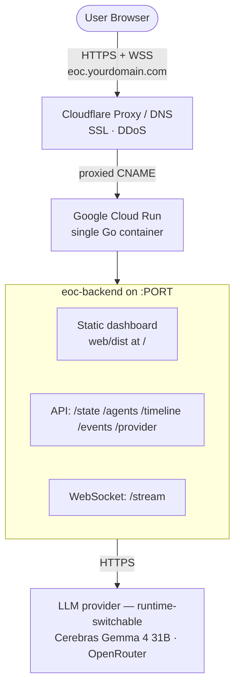

# EOC Deployment Guide: Single-Origin on Google Cloud Run + Cloudflare

This guide deploys the **Cerebro Emergency Operations Center (EOC)** as a
**single origin**: one Go container on **Google Cloud Run** serves *both* the
static Astro/Svelte dashboard *and* the API/WebSocket, fronted by **Cloudflare**
for DNS, SSL, and DDoS protection.

> **Why single-origin (not Pages + separate API)?** The frontend talks to the
> backend **same-origin**: the WebSocket URL is `wss://<page-host>/stream`
> ([`web/src/components/Dashboard.svelte`](web/src/components/Dashboard.svelte))
> and REST calls are relative (`fetch("/state")`). Splitting the UI and API onto
> two subdomains would make every live call cross-origin → the dashboard would
> silently fall back to its offline **demo mode**, and would additionally require
> CORS middleware (the API has none). Serving both from one container matches the
> code as written, removes CORS entirely, and removes a whole deploy target.

---

## 1. Deployment Architecture



One container, one origin:
1. **Static dashboard** — the built `web/dist` is served at `/` by the Go server.
2. **API + WebSocket** — `/state`, `/agents`, `/timeline`, `/events`, `/stream`
   on the same host. No CORS needed (same origin).
3. **Cloudflare** — one proxied CNAME → Cloud Run, free SSL/TLS, DDoS.

---

## 2. Prerequisites

- The Go server must (a) serve the static build and (b) **listen on `$PORT`**
  (Cloud Run's contract — it injects `PORT`, default `8080`). See HANDOFF §8
  parcel **P6**; the server reads `PORT` (fallback `8080`) and serves the
  directory in `WEB_DIR` (default `web/dist`) at `/`.
- The container build produces a single image containing both the Go binary and
  `web/dist` (multi-stage `Dockerfile`; see parcel **P8**).
- Local development / testing can use `.env.example` (copy to `.env`) for
  `PORT`, `WEB_DIR`, `CEREBRAS_*`, and `OPENROUTER_*` (see §4.1 for the
  dual-provider model).

---

## 3. Build the Container (one image, both tiers)

The multi-stage [Dockerfile](Dockerfile) builds the web assets and the Go binary,
then assembles a minimal runtime image. Build it from the project root:

```bash
# Builds web/dist (Node stage) + the eoc binary (Go stage) into one image.
docker build -t REGION-docker.pkg.dev/YOUR_GCP_PROJECT/eoc/eoc-backend:latest .
```

> Use **Artifact Registry** (`REGION-docker.pkg.dev/...`), not the deprecated
> `gcr.io` Container Registry. Create the repo once:
> `gcloud artifacts repositories create eoc --repository-format=docker --location=REGION`.

Push it:

```bash
gcloud auth configure-docker REGION-docker.pkg.dev
docker push REGION-docker.pkg.dev/YOUR_GCP_PROJECT/eoc/eoc-backend:latest
```

---

## 4. Deploy to Cloud Run

```bash
gcloud run deploy eoc-backend \
    --image REGION-docker.pkg.dev/YOUR_GCP_PROJECT/eoc/eoc-backend:latest \
    --platform managed \
    --region REGION \
    --allow-unauthenticated \
    --min-instances 1 \
    --timeout 3600 \
    --set-secrets CEREBRAS_API_KEY=cerebras-api-key:latest,OPENROUTER_API_KEY=openrouter-api-key:latest \
    --set-env-vars CEREBRAS_MODEL=gemma-4-31b,OPENROUTER_MODEL=google/gemma-4-31b-it
```

> `OPENROUTER_*` are **optional** — drop them to ship a Cerebras-only service.
> Include them to enable the runtime provider switch (§4.1). Base URLs default
> correctly (`api.cerebras.ai/v1`, `openrouter.ai/api/v1`) and rarely need setting.

Notes:
- **Do not pass `--port`** unless you have a reason to; Cloud Run injects `$PORT`
  and the server honors it. (The image `EXPOSE`s `8080` as the default.)
- **`--min-instances 1`** avoids cold-start dropping the first WebSocket
  connection during a live demo. (Trade-off: it no longer scales to zero, so it
  costs a little while idle — fine for a demo window; drop back to `0` after.)
- **`--timeout 3600`** raises the request timeout to 60 min so long-lived
  WebSocket streams aren't cut at the 5-min default.
- **Secrets, not env vars, for the API key** — `--set-secrets` pulls from Secret
  Manager so the key isn't visible in `gcloud run services describe` / deploy
  history. Create it once:
  `printf '%s' "$KEY" | gcloud secrets create cerebras-api-key --data-file=-`.
  (If you must, `--set-env-vars CEREBRAS_API_KEY=...` works but is less safe.)
  Create the OpenRouter secret the same way:
  `printf '%s' "$KEY" | gcloud secrets create openrouter-api-key --data-file=-`.
- `gemma-4-31b` is native multimodal — the same model serves text reasoning and
  image perception (`POST /perception`, parcels P2/P5). The OpenRouter default
  (`google/gemma-4-31b-it`) is the same model family, so vision works on both.

Cloud Run prints the service URL (e.g. `https://eoc-backend-xxxx.a.run.app`).
Verify before wiring DNS: open the URL — the dashboard should load and connect to
its own `/stream` in **live** mode (not demo mode).

---

## 4.1 Dual-provider configuration & switching (P9–P12)

The server runs **one LLM client** that can speak to either **Cerebras** or
**OpenRouter** (OpenAI-compatible). Both speak text reasoning *and* vision.

**Per-provider config** (env or Secret Manager):

| Provider | Key | Model (default) | Base URL (default) |
|---|---|---|---|
| Cerebras | `CEREBRAS_API_KEY` | `CEREBRAS_MODEL` = `gemma-4-31b` | `https://api.cerebras.ai/v1` |
| OpenRouter | `OPENROUTER_API_KEY` | `OPENROUTER_MODEL` = `google/gemma-4-31b-it` | `https://openrouter.ai/api/v1` |

**Which provider is active at boot** (current behavior — [`cmd/eoc/main.go`](cmd/eoc/main.go)):
1. Defaults to **Cerebras**.
2. Falls back to **OpenRouter** *only* if `CEREBRAS_API_KEY` is **unset** *and*
   `OPENROUTER_API_KEY` is **set**.
3. If neither key is set (or `LLM_MOCK=true`), the client runs in **mock mode**
   (deterministic canned responses — fine for a UI demo, no spend).

> ⚠️ **Gap:** there is no explicit env var to force OpenRouter at boot when a
> Cerebras key is *also* present. With both keys set you boot on Cerebras and must
> switch at runtime (below). A small follow-up (an `LLM_PROVIDER` override) lives
> in the `cmd/eoc` lane (P11), not this docs parcel.

**Switching at runtime** (no redeploy — P10/P11/P12):
- `GET /provider` → `{"provider":"cerebras"}` (current active provider).
- `POST /provider` with `{"provider":"openrouter"}` → switches the active client;
  the change is **broadcast over `/stream`** so every connected dashboard updates.
- The UI exposes this as a **provider dropdown** (P12); selecting an option calls
  `POST /provider`, and logs/labels reflect the active provider.
- Switching to a provider whose key is **unconfigured** drops that provider into
  **mock mode** — set both keys if you want to demo a live A/B between them.

---

## 5. Cloudflare DNS (single subdomain)

To serve at `eoc.yourdomain.com`:
1. Cloud Run console → service → **Custom domains** can map directly, **or** use
   Cloudflare DNS:
2. Cloudflare Dashboard → your domain → **DNS** → **Add record** → **CNAME**.
3. Name `eoc`, Target = the Cloud Run hostname (without `https://`).
4. **Proxy status: Proxied** (orange cloud) so Cloudflare terminates SSL.
5. **SSL/TLS → Overview → Full (strict)** so Cloudflare↔Cloud Run is encrypted.

That's the only DNS record needed — UI, API, and WSS all ride the one origin.

---

## 6. Verification checklist

- [ ] `docker build .` produces an image containing the binary **and** `web/dist`.
- [ ] `docker run -p 8080:8080 -e PORT=8080 <image>` → dashboard at
      `http://localhost:8080/` loads and connects live to `/stream`.
- [ ] Container also honors a non-default port: `-e PORT=9090 -p 9090:9090` works
      (proves the `$PORT` contract).
- [ ] On Cloud Run, the page loads in **live** mode (HUD shows real metrics, not
      the demo cascade).
- [ ] WSS stays connected through a full scenario replay (no 5-min cutoff).
- [ ] No CORS errors in the browser console (there shouldn't be — same origin).
- [ ] **Cerebras**: with `CEREBRAS_API_KEY` set, text reasoning (cell fan-out) and
      vision (`POST /perception`) both return real (non-mock) output.
- [ ] **OpenRouter**: with `OPENROUTER_API_KEY` set, `POST /provider`
      `{"provider":"openrouter"}` switches live; text + vision both work; the
      switch is reflected in the dashboard (dropdown + logs) via `/stream`.

---

## 7. What this guide intentionally drops vs. a two-origin setup

- **No Cloudflare Pages target** — the Go container serves the UI.
- **No CORS middleware** — same origin means none is required.
- **No `PUBLIC_API_URL` frontend config** — the dashboard's same-origin
  WS/fetch logic works unchanged.

If you ever do want the UI on Cloudflare's CDN separately, that's a larger change
(frontend API-host config + backend CORS + `$PORT`); it is **out of scope** for
this single-origin deployment.
